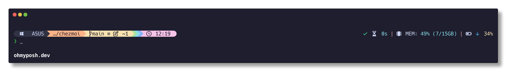

# WINDOWS-DOTFILES

> [!IMPORTANT]
>
> Please note that this repository is still under development. Use this as a reference only. Just grab what you need and modify it to your liking.

---

## Table of Contents
- [WINDOWS-DOTFILES](#windows-dotfiles)
  - [Table of Contents](#table-of-contents)
  - [❄️ Information](#️-information)
  - [🖼️ Preview](#️-preview)
    - [Terminal](#terminal)
    - [Prompt](#prompt)
    - [Check Wifi Passwords](#check-wifi-passwords)
    - [Manage Apps (Scoop)](#manage-apps-scoop)
  - [📦 Installation](#-installation)
  - [➕ Extra](#-extra)
  - [📝 Notes](#-notes)

---

## ❄️ Information

Here are some details about my setup:
- **OS**: Windows 11
- **Terminal**: [WezTerm](https://github.com/wez/wezterm/)
- **Shell**: [PowerShell](https://github.com/PowerShell/PowerShell/)
- **Editor**: [VSCode](https://code.visualstudio.com/)
- **Package Manager**: [Scoop](https://scoop.sh/)
- **App Launcher**: [Flow Launcher](https://www.flowlauncher.com/)
- **Tiling WM**: [Komorebi](https://github.com/LGUG2Z/komorebi/)
- **Font**: [JetBrains Mono Nerd Font](https://github.com/ryanoasis/nerd-fonts/blob/master/patched-fonts/JetBrainsMono/)

## 🖼️ Preview

### Terminal

- **Color Scheme**: [Catppuccin Mocha](https://github.com/catppuccin/wezterm/) with some modifications
- **Fetch**: [fastfetch](https://github.com/fastfetch-cli/fastfetch/)

> [!IMPORTANT]
>
> The terminal preview is using the [JetBrains Mono Nerd Font](https://github.com/ryanoasis/nerd-fonts/blob/master/patched-fonts/JetBrainsMono/) or any nerd font, which is not included in this repository. You can download it from the link provided. 
> 
> The image on the fetch requires the iTerm2 image support. You need a terminal emulator that supports image rendering to display the image, like [WezTerm](https://github.com/wez/wezterm/).

### Prompt

- **Prompt**: [Oh-My-Posh](https://ohmyposh.dev/).

The prompt uses Catppuccino Mocha color scheme with some modifications. The left prompt is heavily inspired by typecraft-dev's starship [prompt](https://github.com/typecraft-dev/dotfiles/). Each color represents a different context:
- **Grey**: User
- **Orange**: Directory
- **Yellow**: Git
- **Green**: Spotify
- **Light Blue**: Oh-My-Posh update
- **Blue**: Docker
- **Pink**: Time

### Check Wifi Passwords

|                       **SELECT**                      |                        **SHOWN**                      |
| :---------------------------------------------------: | :---------------------------------------------------: |
|  |  |

> [!NOTE]
>
> The script will use fzf if it is installed. Works with or without fzf.

### Manage Apps (Scoop)

|                  **UPGRADE**                   |                    **UNINSTALL**                  |
| :--------------------------------------------: | :-----------------------------------------------: |
|  |  |

## 📦 Installation
soon™

## ➕ Extra

## 📝 Notes
soon™

