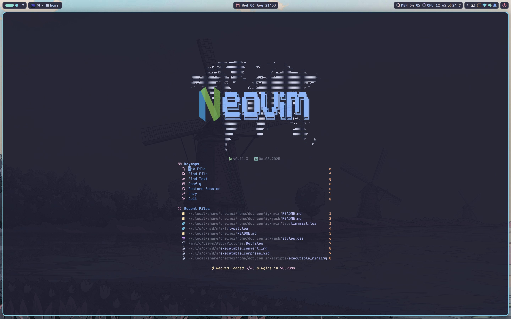

  
  neovim

  

  &nbsp;&nbsp;
  

 

---

## Quick Start

### Requirements

- [Neovim v0.11+](https://github.com/neovim/neovim/releases/tag/stable) (this config uses the new `vim.lsp` API)
- [Git](https://git-scm.com/) for plugin management
- [A Nerd Font](https://www.nerdfonts.com/) like `JetBrains Mono Nerd Font` for icons
- [Ripgrep](https://github.com/BurntSushi/ripgrep) for faster file search
- A C compiler for nvim-treesitter. See [here](https://github.com/nvim-treesitter/nvim-treesitter#requirements)
- curl for [blink.cmp](https://github.com/Saghen/blink.cmp) (completion engine)
- A terminal that support true color and UTF-8 support
  - [Kitty](https://github.com/kovidgoyal/kitty) (Linux & MacOS)
  - [Ghostty](https://github.com/ghostty-org/ghostty/) (Linux & MacOS)
  - [Wezterm](https://github.com/wez/wezterm) (Linux, MacOS & Windows)
  - [alacritty](https://github.com/alacritty/alacritty) (Linux, MacOS & Windows)

> [!WARNING]
> **Note:**
>
> - The Dashboard logo uses glyphs from `Symbols for Legacy Computing`, make sure your terminal supports it

## Features

- Lazy loading with [lazy.nvim](https://github.com/folke/lazy.nvim)
- Extensive use of [snacks.nvim](https://github.com/folke/snacks.nvim) including custom pickers
- Custom statusline built with [heirline.nvim](https://github.com/rebelot/heirline.nvim)
- Completions with [blink.cmp](https://github.com/Saghen/blink.cmp)
- Extensive use of [mini.icons](https://github.com/echasnovski/mini.icons) throughout the config for a cohesive appearance
- Custom terminal manager (also a picker in disguise)
- Custom cmdline and message events views (soon)

---

	

