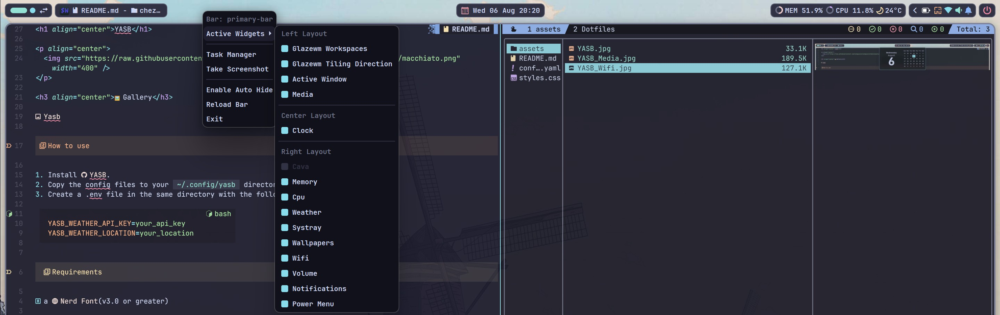
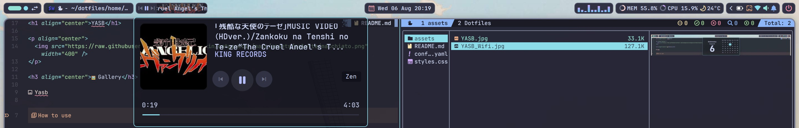
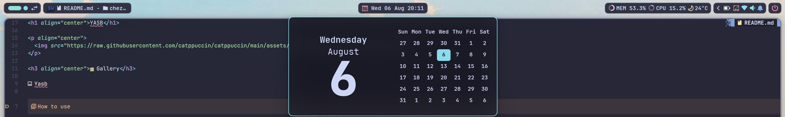
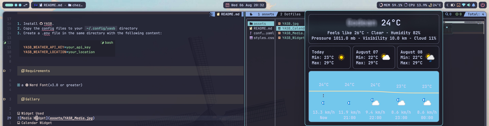
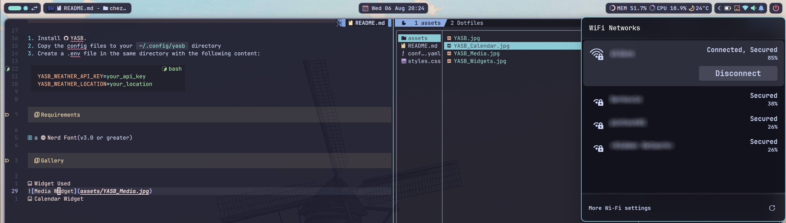

<h1 align="center">YASB</h1>

<p align="center">
  
</p>

<h3 align="center">🖼️Gallery</h3>


## How to use

1. Install [YASB](https://github.com/amnweb/yasb).
2. Copy the config files to your `~/.config/yasb` directory
3. Create a .env file in the same directory with the following content:

```bash
YASB_WEATHER_API_KEY=your_api_key
YASB_WEATHER_LOCATION=your_location
```

### Requirements

- a [Nerd Font](https://www.nerdfonts.com/)(v3.0 or greater)

### Gallery

- Widgets Used:
  

- Media Widget:
  

- Calendar Widget:
  

- Weather Widget:
  

- Systray Widget:
  

- Wifi Widget:
  

---

<p align="center">
	
</p>
